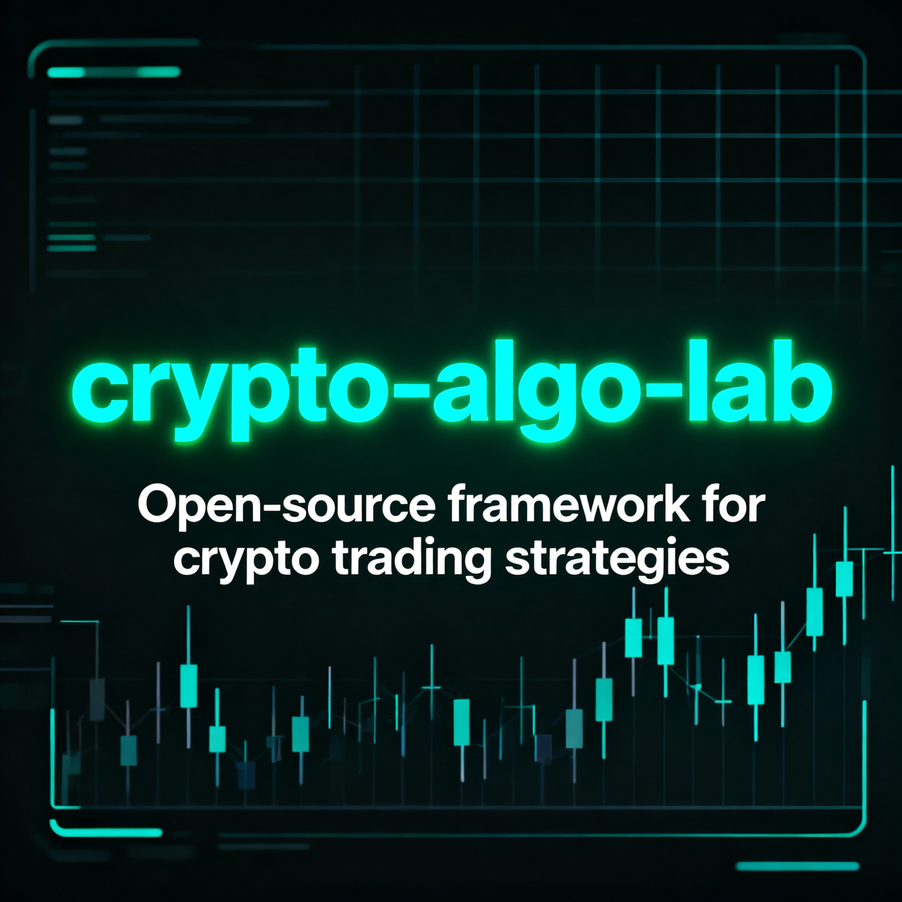

<p align="center">
  
</p>

<p align="center">
  <b>Turn crypto trading ideas into real backtests and bots — without drowning in boilerplate.</b>
</p>

<p align="center">
  <a href="https://github.com/kenoxxx/crypto-algo-lab/actions">
    
  </a>
  <a href="https://github.com/kenoxxx/crypto-algo-lab/blob/main/LICENSE.txt">
    
  </a>
  <a href="https://github.com/kenoxxx/crypto-algo-lab/stargazers">
    
  </a>
</p>

---

## ✨ What is crypto-algo-lab?

`crypto-algo-lab` is a Python framework for traders and quants who want to turn crypto ideas into numbers fast.  
It gives you ready-made pieces for OHLCV data loading via `ccxt`, a backtest engine, and a clean place for your strategy logic.  

You can:

- ⚙️ Fetch historical candles from multiple exchanges in one line.
- 📈 Run repeatable backtests across symbols and timeframes.
- 🚀 Use the same structure later as a base for simple live bots.

---

## ⚡ Quick start

```bash
git clone https://github.com/kenoxxx/crypto-algo-lab.git
cd crypto-algo-lab

pip install -e .
pytest
